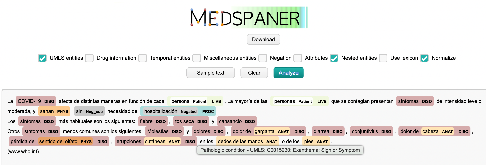

Medical Information Annotation tool
==============================================

This is a hybrid (neural-network-based, lexicon-based and rule-based) sequence labeling tool for the medical domain. It was originally developed for medical named entity recognition of clinical trial texts, but it can be applied to other medical text types.

The annotation tool can perform the following tasks:
- medical named entity recognition of 7 [Unified Medical Language System (UMLS)](https://www.nlm.nih.gov/research/umls/index.html) semantic groups (ANAT, CHEM, DEVI, DISO, LIVB, PHYS, PROC)
- temporal annotation using the TimeML scheme: Date, Duration, Frequency (also known as *set*) and Time; Age is also added to the scheme
- annotation of negation and uncertainty/speculation
- annotation of medication information: Contraindication, Dosage or Strength, Route and Form

The lexicon is [MedLexSp](https://github.com/lcampillos/MedLexSp), a computational vocabulary with lemmas and variant forms mapped to UMLS CUIs. It can be obtained via an usage license at: [https://digital.csic.es/handle/10261/270429](https://digital.csic.es/handle/10261/270429)

Rules were developed iteratively during the annotation of the [CT-EBM-ES corpus](https://zenodo.org/record/6059737#.YtPYTMHP1H0). Standard algorithms were implemented, such as [NegEx](https://github.com/PlanTL-GOB-ES/NegEx-MES) and [HeidelTime](https://github.com/HeidelTime/heideltime) adapted to the [Spanish language](https://github.com/PlanTL-GOB-ES/EHR-TTS).

The [guideline](https://github.com/lcampillos/medspaner/blob/main/annot_guideline_2022_anonyn.pdf) with the criteria for annotating the [CT-EBM-ES corpus](https://zenodo.org/record/6059737#.YtPYTMHP1H0) is [available in this repository](https://github.com/lcampillos/medspaner/blob/main/annot_guideline_2022_anonyn.pdf).

The neural model is [RoBERTA model trained on clinical and EHR data](https://huggingface.co/PlanTL-GOB-ES/bsc-bio-ehr-es), trained by the Barcelona Supercomputing Center, and fine-tuned in clinical trials annotated for different tasks: medical named entity recognition, temporal annotation, annotation of medication drug attributes, and annotation of negation and uncertainty/speculation.

To annotate a single text, run with:

    python medianno.py -conf config.conf -input PATH/TO/FILE.txt

To annotate a directory, run with:

    python medianno_dir.py -conf config.conf -input PATH/TO/DIR


Requirements
-------------------------

* python (tested with 3.7)
* [spacy](https://spacy.io/) (tested with 3.3.1)
* [textsearch](https://github.com/kootenpv/textsearch)


Data format
-------------------------

The data is a standard text file (.txt)
    

Configuration
-------------------------

Edit the fields in the configuration file (config.conf) to adapt it to your purposes:

* **drg** - Select ```True``` to annotate drug features such as Dosage Form, Dose or Strength, or Route; select ```False``` otherwise
* **lex** - Use lexicon for the annotation of UMLS entities; by default, the lexicon is located at: ```lexicon/MedLexSp.pickle```; indicate ```False``` if no lexicon is needed
* **neg** - Select ```True``` to annotate entities expressing negation and uncertainty; select ```False``` otherwise
* **neu** - Select ```True``` (default value) to annotate UMLS entities with the trained neural model; select ```False``` otherwise
* **nest** - Select ```True``` to output inner or nested entities inside wider entities (e.g. *pecho* in *cáncer de pecho*); select ```False``` to output only the entities with the wider scope (*flat entities*)
* **norm** - Select ```True``` if the output needs to be normalized to UMLS CUIs (only output in BRAT ```ann``` format); select ```False``` otherwise
* **out** - Indicate ```ann``` ([BRAT](https://brat.nlplab.org/) format) or ```json``` (standard JSON data format)
* **temp** - Select ```True``` to annotate temporal expressions according to the HeidelTime scheme (Date, Duration, Frequency, Time) and Age; select ```False``` otherwise

References
-------------------------

<!---The annotation tool is described here:

**NLP tools for fast annotation of clinical trial texts**  
Leonardo Campillos-Llanos ...  
*In Proceedings of ...*
--->

The Medical Lexicon for Spanish (MedLexSp) is described here:

[**MedLexSp – A Medical Lexicon for Spanish Medical Natural Language Processing**](https://github.com/lcampillos/MedLexSp)  
Leonardo Campillos-Llanos  
*(Under review)*

[**First Steps towards Building a Medical Lexicon for Spanish with Linguistic and Semantic Information**](https://aclanthology.org/W19-5017/)  
Leonardo Campillos-Llanos.
*Proc. of BioNLP 2019*, August 1st, 2019, Florence, Italy, pp. 152–164

The Clinical Trials for Evidence-based Medicine in Spanish (CT-EBM-SP) corpus is explained in this article:

[**A clinical trials corpus annotated with UMLS entities to enhance the access to evidence-based medicine**](https://bmcmedinformdecismak.biomedcentral.com/articles/10.1186/s12911-021-01395-z)  
Leonardo Campillos-Llanos, Ana Valverde-Mateos, Adrián Capllonch-Carrión and Antonio Moreno-Sandoval 
*BMC Med Inform Decis Mak* (2021) 21:69 


Intended uses & limitations
---------------------------

This tool is under development and needs to be improved. It should not be used for medical decision making without human assistance and supervision. It is intended for a generalist purpose, and may have bias and/or any other undesirable distortions.

Third parties who deploy or provide systems and/or services using any of these tools (or using systems based on these models) should note that it is their responsibility to mitigate the risks arising from their use. Third parties, in any event, need to comply with applicable regulations, including regulations concerning the use of artificial intelligence.

The owner or creator of the annotation system will in no event be liable for any results arising from the use made by third parties of these models.


License
---------------------------

The code is distributed under the General Public License 3 (AGPL-3.0) by default. 
If you wish to use it under a different license, feel free to get in touch.

Copyright (c) 2019-2022 Leonardo Campillos-Llanos

This program is free software: you can redistribute it and/or modify it under the terms of the GNU General Public License as published by the Free Software Foundation, either version 3 of the License, or (at your option) any later version.

This program is distributed in the hope that it will be useful, but WITHOUT ANY WARRANTY; without even the implied warranty of MERCHANTABILITY or FITNESS FOR A PARTICULAR PURPOSE. See the GNU Affero General Public License for more details.


Funding
---------------------------

This tool was developed in the NLPMedTerm project, funded by InterTalentum UAM, Marie Skłodowska-Curie COFUND grant (2019-2021) (H2020 program, contract number 713366), and in the CLARA-MeD project (reference: PID2020-116001RA-C33), funded by MCIN/AEI/10.13039/501100011033/, in project call: "Proyectos I+D+i Retos Investigación".


